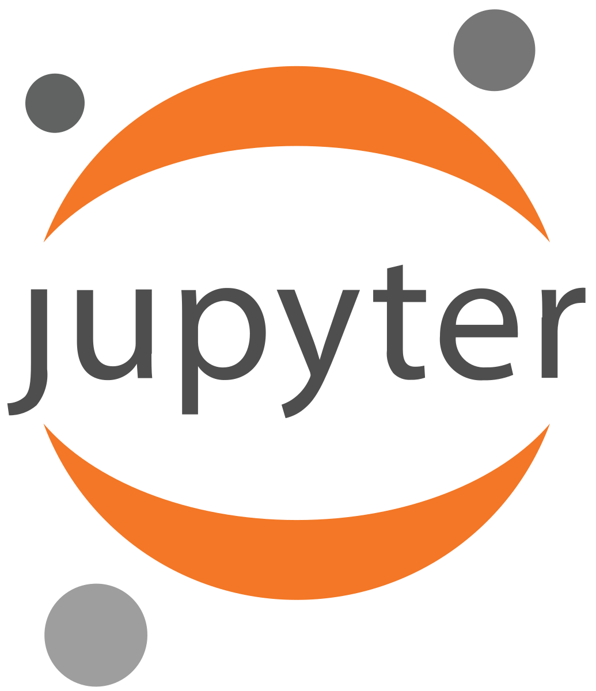

# Jupyter-Notebook
Labs, Projects, and Libraries with Jupyter Book for explanation, and source code

# Course

## Machine Learning Projects with Jupyter Notebook

https://dune-web-e44.notion.site/Machine-Learning-Projects-with-Jupyter-Notebook-277622d6055680ae9c16c4f77b9cd9af?source=copy_link

## Python: The NumPy Library

https://www.notion.so/Python-Library-NumPy-272622d6055680bea96ce02fbf4ea79d?source=copy_link

## Python: The Pandas Library

https://www.notion.so/Python-Library-Pandas-265622d6055680c693ffd2aeeacd9220?source=copy_link

## Python: The Seaborn Library

https://www.notion.so/Python-Library-Seaborn-265622d60556800ca7bbc4022bd94832?source=copy_link

